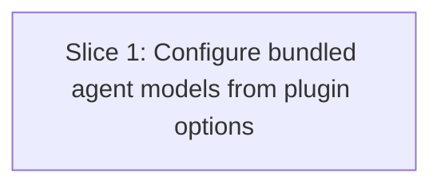

# Plan: Model Configuration

**Created**: 2026-08-08
**Branch**: main
**Status**: draft
**Gherkin persistence**: plan-file-only
**Scope enforcement**: none

## Goal

Allow users of the opencode-dev-team plugin to choose which model each bundled agent and subagent uses through the plugin tuple options in `opencode.json` / `opencode.jsonc`, without editing bundled agent markdown files. Configured agents use the user-provided model; unconfigured agents omit the `model` property so opencode's global `model` default applies. Existing agent frontmatter `model:` lines stay in place for now but no longer drive runtime model selection.

## Approach Stance

- **Destructive shape — replace vs. merge:** Merge user model choices into generated agent configs only; preserve existing user config, plugin options, and bundled markdown frontmatter.
- **Scope — touch only requested:** Limit implementation to plugin option plumbing, config hook behavior, tests, and a README usage example. Do not add a UI, model discovery, validation against providers, or command-line tooling.
- **Integration — auto-merge vs. direct-to-trunk:** Use normal PR flow with green checks; no direct-to-trunk merge.
- **Evolution — migrate vs. edit stub:** Edit the canonical plugin entry/config hook path (`src/index.ts`, `src/config-hook.ts`), not generated install output or copied `.opencode` artifacts.
- **Format fidelity:** Preserve native JSON/JSONC configuration semantics; document tuple-form plugin options rather than inventing an unsupported top-level config shape.

## Acceptance Criteria

- [ ] Users can configure any bundled primary agent or subagent model using plugin tuple options, e.g. `"plugin": [["opencode-dev-team", { "agentModels": { "builder": "anthropic/claude-sonnet-4-6" } }]]`.
- [ ] When an agent has an explicit non-empty string `agentModels[agentName]`, the registered `config.agent[agentName].model` equals that configured model.
- [ ] When plugin options are absent, `null`, `{}`, or an agent key is absent from `agentModels`, each unconfigured registered agent object does not contain a `model` property, so opencode's global default model applies instead of the markdown frontmatter model.
- [ ] When `agentModels` is not a plain object (`null`, string, number, boolean, or array), registration completes and all bundled registered agent objects do not contain a `model` property.
- [ ] When `agentModels` is an empty object, registration completes and all bundled registered agent objects do not contain a `model` property.
- [ ] When an individual `agentModels` entry is not a non-empty string (`null`, empty string, number, boolean, array, or plain object), that agent object does not contain a `model` property while other agents with valid entries are unaffected.
- [ ] Unknown keys in `agentModels` are ignored: they do not create new agents, do not change the count of registered bundled agents, do not change the count of registered bundled commands, and do not affect command models.
- [ ] Each registered agent config's `description`, `mode`, `color`, and `permission` fields equal the frontmatter values from the corresponding bundled markdown file, and `prompt` equals that file's body content, regardless of whether a model override is configured.
- [ ] Each registered command retains, at minimum, its `description`, `agent`, `template`, and command-level `model` from command frontmatter; `agentModels` does not override commands.
- [ ] README contains a syntactically valid JSON/JSONC tuple-form `opencode.json` example with `agentModels`, at least one configured bundled-agent entry, at least one other bundled agent omitted from the table, and fallback prose stating that omitted agents inherit the global `model` default.

## Slices

A slice is a vertically deliverable increment. Each slice carries the Gherkin scenario(s) that define its behavior, followed by the TDD steps that satisfy them. Steps are numbered `<sliceId>.<step>`.

### Slice 1: Configure bundled agent models from plugin options

**Depends-on:** none
**Files:** `src/index.ts`, `src/config-hook.ts`, `src/config-hook.test.ts`, `README.md`

**Behavior:**

```gherkin
Feature: Configurable models for bundled agents

  Scenario: Configured primary agent uses the requested model
    Given the plugin is loaded with an agent model table containing "builder" set to "anthropic/claude-sonnet-4-6"
    When the plugin registers its bundled agents
    Then the registered "builder" agent uses model "anthropic/claude-sonnet-4-6"
    And the registered "builder" agent metadata equals the corresponding bundled markdown frontmatter and body content

  Scenario: Configured subagent uses the requested model
    Given the plugin is loaded with an agent model table containing "plan-review-acceptance" set to "anthropic/claude-haiku-3-5"
    When the plugin registers its bundled agents
    Then the registered "plan-review-acceptance" agent uses model "anthropic/claude-haiku-3-5"
    And the registered "plan-review-acceptance" agent metadata equals the corresponding bundled markdown frontmatter and body content

  Scenario: Plugin loaded without an options argument defaults every bundled agent to the global model
    Given the plugin is loaded without any plugin options argument
    When the plugin registers its bundled agents
    Then registration completes without crashing
    And no registered bundled agent object contains a "model" property

  Scenario: Plugin loaded with null options defaults every bundled agent to the global model
    Given the plugin is loaded with plugin options set to the JavaScript value null
    When the plugin registers its bundled agents
    Then registration completes without crashing
    And no registered bundled agent object contains a "model" property

  Scenario: Plugin options without a model table default every bundled agent to the global model
    Given the plugin is loaded with plugin options that contain no "agentModels" key
    When the plugin registers its bundled agents
    Then no registered bundled agent object contains a "model" property

  Scenario: Partial model table configures only listed agents
    Given the plugin is loaded with an agent model table containing only "builder" set to "anthropic/claude-sonnet-4-6"
    When the plugin registers its bundled agents
    Then the registered "builder" agent uses model "anthropic/claude-sonnet-4-6"
    And the registered "planner" agent object contains no "model" property
    And the registered "specs" agent object contains no "model" property

  Scenario: Empty model table defaults every bundled agent to the global model
    Given the plugin is loaded with agentModels set to an empty object
    When the plugin registers its bundled agents
    Then registration completes without crashing
    And no registered bundled agent object contains a "model" property

  Scenario: Null model table is ignored safely
    Given the plugin is loaded with agentModels set to the JavaScript value null
    When the plugin registers its bundled agents
    Then registration completes without crashing
    And no registered bundled agent object contains a "model" property

  Scenario: String model table is ignored safely
    Given the plugin is loaded with agentModels set to the string "invalid"
    When the plugin registers its bundled agents
    Then registration completes without crashing
    And no registered bundled agent object contains a "model" property

  Scenario: Numeric model table is ignored safely
    Given the plugin is loaded with agentModels set to the number 42
    When the plugin registers its bundled agents
    Then registration completes without crashing
    And no registered bundled agent object contains a "model" property

  Scenario: Boolean model table is ignored safely
    Given the plugin is loaded with agentModels set to the boolean true
    When the plugin registers its bundled agents
    Then registration completes without crashing
    And no registered bundled agent object contains a "model" property

  Scenario: Array model table is ignored safely
    Given the plugin is loaded with agentModels set to an empty array
    When the plugin registers its bundled agents
    Then registration completes without crashing
    And no registered bundled agent object contains a "model" property

  Scenario: Null builder model entry is treated as unconfigured while valid entries still apply
    Given the plugin is loaded with an agent model table containing "builder" set to the JavaScript value null
    And the same table contains "planner" set to "anthropic/claude-sonnet-4-6"
    When the plugin registers its bundled agents
    Then the registered "builder" agent object contains no "model" property
    And the registered "planner" agent uses model "anthropic/claude-sonnet-4-6"

  Scenario: Numeric specs model entry is treated as unconfigured while valid entries still apply
    Given the plugin is loaded with an agent model table containing "specs" set to the number 42
    And the same table contains "builder" set to "anthropic/claude-sonnet-4-6"
    When the plugin registers its bundled agents
    Then the registered "specs" agent object contains no "model" property
    And the registered "builder" agent uses model "anthropic/claude-sonnet-4-6"

  Scenario: Empty string model entry is treated as unconfigured while valid entries still apply
    Given the plugin is loaded with an agent model table containing "builder" set to an empty string
    And the same table contains "planner" set to "anthropic/claude-sonnet-4-6"
    When the plugin registers its bundled agents
    Then the registered "builder" agent object contains no "model" property
    And the registered "planner" agent uses model "anthropic/claude-sonnet-4-6"

  Scenario: Boolean model entry is treated as unconfigured
    Given the plugin is loaded with an agent model table containing "planner" set to the boolean false
    When the plugin registers its bundled agents
    Then the registered "planner" agent object contains no "model" property

  Scenario: Array model entry is treated as unconfigured
    Given the plugin is loaded with an agent model table containing "specs" set to an empty array
    When the plugin registers its bundled agents
    Then the registered "specs" agent object contains no "model" property

  Scenario: Object model entry is treated as unconfigured
    Given the plugin is loaded with an agent model table containing "plan-review-design" set to an empty object
    When the plugin registers its bundled agents
    Then the registered "plan-review-design" agent object contains no "model" property

  Scenario: Unknown agent names are ignored without changing registered agent cardinality
    Given the plugin is loaded with an agent model table containing "nonexistent-a" set to "some/provider-model"
    And the same table contains "nonexistent-b" set to "another/provider-model"
    And the same table contains "builder" set to "anthropic/claude-sonnet-4-6"
    When the plugin registers its bundled agents
    Then the total number of registered bundled agents equals the deterministic bundled agent markdown file count
    And no "nonexistent-a" agent is registered
    And no "nonexistent-b" agent is registered
    And no registered bundled agent uses model "some/provider-model"
    And no registered bundled agent uses model "another/provider-model"

  Scenario: Agent model table does not affect command registration
    Given the plugin is loaded with an agent model table containing "builder" set to "anthropic/claude-sonnet-4-6"
    When the plugin registers bundled slash commands
    Then the registered "specs" command keeps its description, agent, template, and command-level model from the bundled "specs" command frontmatter and body
    And the registered "planner" command keeps its description, agent, template, and command-level model from the bundled "planner" command frontmatter and body
    And no command model is changed by the agent model table

  Scenario: Agent model table does not affect command count
    Given the plugin is loaded with an agent model table containing "nonexistent-x" set to "some/model"
    When the plugin registers bundled slash commands
    Then the total number of registered commands equals the deterministic bundled command markdown file count

  Scenario: Documentation contains valid tuple options and fallback language
    Given the file README.md exists at the repository root and its contents are loaded as a string
    When its model configuration section is inspected
    Then the first JSON or JSONC code fence block in that section parses without error using a JSONC-capable parser
    And the parsed value has a top-level "plugin" key whose first element is an array tuple
    And that tuple options object contains "agentModels" with at least one configured bundled-agent model string
    And at least one other bundled agent name is absent from that snippet's "agentModels" table
    And the fallback paragraph states that omitted agents inherit the global "model" default
```

**Steps:**

#### Step 1.1: Pass plugin options into the config hook

**Complexity**: standard
**IMPLEMENT**: Change the plugin entrypoint to accept opencode plugin options as the plugin function's second argument (`Plugin = (input, options?)`) and pass them to `configHook`, without changing install hooks, tools, chat hooks, or event hooks.
**TEST**: Add focused unit coverage asserting that when options `{ agentModels: { builder: "test/provider-model" } }` are supplied, registration does resolve `agentModels.builder` into `config.agent.builder.model === "test/provider-model"`; add a companion assertion that when options are omitted entirely, `'model' in config.agent.builder === false`; full suite green.
**REFACTOR**: Extract a narrow `DevTeamPluginOptions` / `AgentModelTable` type at a shared boundary so option plumbing is typed without coupling the entrypoint to hook internals.
**Files**: `src/index.ts`, `src/config-hook.ts`, `src/config-hook.test.ts`
**Commit**: `Pass plugin options to config hook`

#### Step 1.2: Apply configured model overrides and global-default fallback

**Complexity**: standard
**IMPLEMENT**: First extract a shared helper for agent/subagent registration, then resolve each agent/subagent model inside that helper from valid `agentModels[agentName]`; include a `model` property only when a non-empty string is configured, otherwise omit the property so opencode uses the global default. Keep command model behavior unchanged.
**TEST**: Add unit tests for configured primary agent, configured subagent, options absent/null/{}, partial table, empty `agentModels` object, non-object tables (`null`, string, number, boolean, array), invalid per-entry values (`null`, empty string, number, boolean, array, object), unknown agent keys with unchanged bundled-agent count, unchanged bundled-command count, command registration preservation, and metadata equality to markdown/frontmatter. Tests must assert property absence using `'model' in config.agent[agentName] === false`, not `=== undefined`; full suite green.
**REFACTOR**: Keep option normalization, model resolution, and markdown-to-agent config mapping cohesive and free of duplicate agent/subagent loops.
**Files**: `src/config-hook.ts`, `src/config-hook.test.ts`
**Commit**: `Configure bundled agent models from plugin options`

#### Step 1.3: Document model configuration

**Complexity**: trivial
**IMPLEMENT**: Add README guidance showing tuple-form plugin options with `agentModels`, the supported agent names, and the global-default fallback for omitted entries.
**TEST**: Add a test case in `src/config-hook.test.ts` that reads `README.md` from the repository root, extracts the first JSON/JSONC code fence from the model configuration section, parses it with a JSONC-capable parser or documented equivalent, and asserts: (1) the top-level `plugin` key is tuple-form, (2) the parsed `agentModels` contains at least one bundled-agent string value, (3) at least one other bundled agent is absent from that table, and (4) the surrounding prose contains both `global` and `default` in the fallback explanation; run the full suite.
**REFACTOR**: Keep the example minimal and aligned with opencode's documented plugin tuple shape.
**Files**: `README.md`, `src/config-hook.test.ts`
**Commit**: `Document agent model configuration`

## Parallelization

Each slice declares `Depends-on`; build waves are derived from those declarations. This plan has one slice, so no same-wave collisions or scope mismatches are present.



| Wave | Slices (parallel) |
|------|-------------------|
| 1 | 1 |

## Complexity Classification

Each step includes a complexity rating that controls review depth during `/build`.

| Step | Rating | Reason |
|---|---|---|
| 1.1 | standard | Small plugin API plumbing with tests. |
| 1.2 | standard | Behavioral config change across agent and subagent registration. |
| 1.3 | trivial | Documentation-only update. |

## Pre-PR Quality Gate

- [ ] All tests pass (`mise run test` or repository-equivalent test command)
- [ ] Type check passes if exposed by project tooling
- [ ] Linter passes if exposed by project tooling
- [ ] `/code-review` passes
- [ ] README documents plugin tuple options and fallback behavior

## Skipped (low value)

| Finding | Rationale (one line) |
|---|---|
| Provider/model existence validation | No provider catalog is available at config-hook time; validating strings here would reject valid custom providers and duplicate opencode's own model resolution. |
| Editing bundled agent frontmatter `model:` values | User explicitly requested keeping them for now, and runtime behavior is covered by omitting unconfigured model overrides. |

## Risks & Open Questions

- No specification artifacts related to this task were found; plan is based on direct code inspection and user clarification. An unrelated existing spec artifact exists at `docs/specs/tui-driven-workflow-control.md`.
- Exact external package name in user config examples may differ between local path, npm package, or built dist path; documentation should show tuple-form shape and note that the first tuple element is whatever plugin spec the user already uses.
- Runtime fallback to opencode's global model depends on omitting the `model` property entirely; tests should assert observable field absence in the generated config.
- `configHook` currently reads bundled markdown from `import.meta.dir`; tests may rely on real bundled files unless implementation introduces explicit directory injection. If directory injection is added, keep it internal/test-only and do not expand user-facing configuration scope.

## Plan Review Summary

Plan tier: standard — one slice touching a small file set with behavior changes and documented default stances. Reviewers: Acceptance Test Critic and Design & Architecture Critic. UX Critic skipped because there is no user-facing UI surface; Strategic Critic skipped by tier.

- Acceptance Test Critic: Initially flagged blocker gaps around malformed option shapes, property absence vs `undefined`, absent/null options, command isolation, and README testability. The plan now enumerates concrete JavaScript invalid shapes, asserts `'model' in config.agent[name] === false`, covers options absent/null/{}, separates ambiguous examples into explicit scenarios, and adds README content/parseability assertions. Final verdict: approve with warnings incorporated.
- Design & Architecture Critic: Approved. Warnings incorporated by making shared agent/subagent registration helper extraction part of Step 1.2 implementation, confirming tuple-form options flow via the plugin function's second `options` argument from the installed plugin type, keeping option types at a shared boundary, and documenting the current filesystem coupling risk for config-hook tests.
- Scope mismatches/collisions: none identified for the single-slice plan.

## Build Progress

This section is the machine-parseable recovery handle. `/build` updates checkboxes here so progress survives a `/clear` or session restart.

### Slices (grouped by wave)

#### Wave 1
- [ ] Slice 1: Configure bundled agent models from plugin options
  - [ ] Step 1.1: Pass plugin options into the config hook
  - [ ] Step 1.2: Apply configured model overrides and global-default fallback
  - [ ] Step 1.3: Document model configuration
