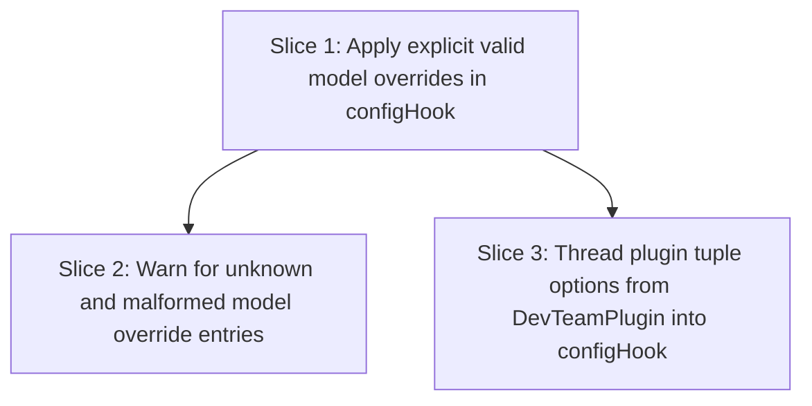

# Plan: Per-Agent Model Override via Plugin Options

**Created**: 2026-08-16
**Branch**: Testing
**Status**: implemented
**Gherkin persistence**: plan-file-only
**Scope enforcement**: none

## Goal

Allow users to override the runtime model for any bundled primary agent or subagent via the plugin tuple options in `opencode.json` / `opencode.jsonc`, using the nested shape `{ model: { "agent-name": "provider/model" } }`. Runtime agent configs should set `model` only for explicitly configured, valid string overrides; unconfigured agents and subagents should omit `model` entirely so opencode's global default applies. Bundled markdown frontmatter `model:` lines stay in place but become inert for runtime model selection.

**Approach stances:**

- **Scope:** strict to model-selection wiring. Touch `src/config-hook.ts`, `src/index.ts`, and focused tests (`src/config-hook.test.ts`, plus `src/index.test.ts` if needed for plugin-boundary coverage). Do not edit bundled agent/subagent markdown, command wiring, `chat.params`, install behavior, or opencode user config files.
- **Replace vs merge:** merge/augment the existing generated agent config shape by conditionally adding `model`; preserve existing fields (`description`, `agent`, `prompt`, `mode`, `color`, `permission`) and existing user config/commands. No wholesale config replacement.
- **Evolution:** edit the canonical plugin entry and config hook directly; do not patch generated install output or deprecated stubs.
- **Integration:** future landing should use the default shared-branch path: PR with green checks / auto-merge, not direct-to-trunk.

## Acceptance Criteria

- [x] AC1: Given options `{ model: { specs: "prov/m1" } }`, when `configHook` runs, then `config.agent.specs.model === "prov/m1"`.
- [x] AC2: Given options `{ model: { "software-engineer": "prov/m2" } }`, when `configHook` runs, then `config.agent["software-engineer"].model === "prov/m2"`.
- [x] AC3: Given no options or options that do not name `planner`, when `configHook` runs, then `config.agent.planner` has no own `model` property, regardless of `planner.md` frontmatter.
- [x] AC4: Given a bundled agent/subagent with frontmatter `model: X` and no tuple override, when `configHook` runs, then that generated agent config has no own `model` property.
- [x] AC5: Given options `{ model: { "does-not-exist": "prov/m" } }`, when `configHook` runs, then (a) a `PluginError` whose `title` and/or `description` contains the exact unknown key verbatim is pushed to `state.errors`, (b) `logger.warn` is called with a message containing the exact unknown key verbatim, (c) no `config.agent["does-not-exist"]` entry is created, and (d) initialization completes without throwing. Any key that is not an exact member of the bundled agent/subagent filename-stem set is treated as unknown; for example, `spec` (a near-miss for `specs`) must also warn as unknown, must not create `config.agent.spec`, and must not affect `config.agent.specs`.
- [x] AC6: A usable model value is a string containing at least one non-whitespace character. Given malformed known-agent model option values `{ specs: "", planner: 42, builder: {}, "software-engineer": null, "spec-reviewer": "   " }`, when `configHook` runs, then for each malformed entry (a) a `PluginError` whose `title` and/or `description` contains the exact agent/subagent name verbatim is pushed to `state.errors`, (b) `logger.warn` is called with a message containing that exact name verbatim, (c) the corresponding generated agent/subagent has no own `model` property, and (d) initialization completes without throwing. Tests may cover these five entries in one table-driven invocation or separate test cases, provided every listed value/name pair and both warning channels are asserted.
- [x] AC7a: Given no plugin options, when `configHook` runs, then no error is thrown, no spurious `state.errors` entry is produced, and every generated bundled agent/subagent entry omits `model`.
- [x] AC7b: Given plugin options without a `model` key, when `configHook` runs, then no error is thrown, no spurious `state.errors` entry is produced, and every generated bundled agent/subagent entry omits `model`.
- [x] AC7c: Given plugin options whose `model` value is not an object (`"string"`, `42`, `[]`, or `null`), when `configHook` runs, then no error is thrown, no spurious `state.errors` entry is produced, and every generated bundled agent/subagent entry omits `model`.
- [x] AC8: The `DevTeamPlugin` function forwards its second `options` argument into `configHook`, so a tuple override supplied at the plugin boundary is observable on the resulting generated agent config.
- [x] AC9: Existing `config-hook.test.ts` behavior remains green: `default_agent === 'specs'`; `plan` and `build` are `hidden: true`; `specs`/`planner`/`builder` are not hidden; custom-agent visibility rules and subagent modes are preserved.

## Slices

A slice is a vertically deliverable increment. Each slice carries the Gherkin scenario(s) that define its behavior, followed by the TDD steps that satisfy them. Steps are numbered `<sliceId>.<step>` (1.1, 1.2, 2.1, …).

### Slice 1: Apply explicit valid model overrides in configHook

**Depends-on:** none
**Files:** `src/config-hook.ts`, `src/config-hook.test.ts`

This slice changes the core model-selection rule in the config hook while keeping startup safe for absent options. It leaves diagnostic warnings for invalid option entries to Slice 2.

**Behavior:**

```gherkin
Feature: Explicit plugin model overrides drive runtime agent models

  Scenario: Configured primary agent uses the provided model
    Given the plugin options configure model "prov/m1" for bundled agent "specs"
    When the dev-team config hook generates agent configuration
    Then the generated "specs" agent has model "prov/m1"

  Scenario: Configured subagent uses the provided model
    Given the plugin options configure model "prov/m2" for bundled subagent "software-engineer"
    When the dev-team config hook generates agent configuration
    Then the generated "software-engineer" subagent has model "prov/m2"

  Scenario: Multiple simultaneous valid overrides are all applied
    Given the plugin options configure model "prov/m1" for bundled agent "specs"
    And the plugin options configure model "prov/m2" for bundled subagent "software-engineer"
    And the plugin options configure model "prov/m3" for bundled agent "planner"
    When the dev-team config hook generates agent configuration
    Then the generated "specs" agent has model "prov/m1"
    And the generated "software-engineer" subagent has model "prov/m2"
    And the generated "planner" agent has model "prov/m3"

  Scenario: Unconfigured primary agent inherits the global model default
    Given the plugin options do not configure a model for bundled agent "planner"
    When the dev-team config hook generates agent configuration
    Then the generated "planner" agent has no own model property

  Scenario: No plugin options leaves all bundled models unset
    Given no plugin tuple options are supplied
    When the dev-team config hook generates agent configuration
    Then every generated bundled primary agent and subagent entry has no own model property
    And the generated "specs" agent has no own model property
    And the generated "planner" agent has no own model property
    And the generated "software-engineer" subagent has no own model property
    And the config hook completes without recording an option warning

  Scenario: Existing workflow-agent config invariants are preserved
    Given the plugin options configure model "prov/m1" for bundled agent "specs"
    When the dev-team config hook generates agent configuration
    Then the default agent is "specs"
    And the generated "plan" agent is hidden
    And the generated "build" agent is hidden
    And the generated "specs" agent is not hidden
    And the generated "planner" agent is not hidden
    And the generated "builder" agent is not hidden
```

**Steps:**

#### Step 1.1: Add configHook options input and conditional valid-model assignment

**Complexity**: standard
**IMPLEMENT**: Extend `configHook` to accept an optional fourth argument typed as `PluginOptions` from `@opencode-ai/plugin`. Normalize `options.model` defensively into an internal model override map only when it is a plain object; absent options, missing `model`, and non-object `model` are treated as an empty map. In both bundled agent loops (`src/agents` and `src/subagents`), remove unconditional `model: data.model`; build the `AgentConfig` without `model`, then conditionally assign `agent.model = override` only when the current filename stem has a non-empty string override. Do not read `data.model` for runtime model selection.
**TEST**: Add focused `config-hook.test.ts` cases for AC1, AC2, AC3, AC4, AC7a, AC7b, and AC9: configured `specs` uses `prov/m1`; configured `software-engineer` uses `prov/m2`; simultaneous valid overrides for `specs`, `software-engineer`, and `planner` all apply in one invocation; unconfigured `planner` has no own `model` property despite the package default; no options and options without `model` cause all generated bundled agent/subagent entries to omit `model` via `Object.values(config.agent).every((agent) => !("model" in agent))`; no options/options-without-model do not throw or append `state.errors`; default-agent and hidden-agent invariants still hold. Keep all existing config-hook visibility/default-agent tests passing unchanged.
**REFACTOR**: Remove or downgrade the current frontmatter-model logging from the agent/subagent loops: if `data.model` is present and no tuple override exists, prefer a low-noise `logger.debug` noting that the frontmatter model is ignored and plugin options should be used for runtime override. Extract a small module-level helper for “get valid override for name” only if it reduces duplication between primary agents and subagents. Move the existing nested `addCommand` helper to module scope during cleanup if doing so keeps helper structure consistent and does not expand behavior. Re-run the focused config-hook tests after cleanup.
**Files**: `src/config-hook.ts`, `src/config-hook.test.ts`
**Commit**: `Apply explicit plugin model overrides in config hook`

### Slice 2: Warn for unknown and malformed model override entries

**Depends-on:** 1
**Files:** `src/config-hook.ts`, `src/config-hook.test.ts`

This slice adds the non-fatal diagnostics required for untrusted tuple options. It reuses the existing `state.errors.push({ title, description })` warning channel and `logger.warn`, and it never creates phantom agents or aborts startup.

**Behavior:**

```gherkin
Feature: Invalid model override options are reported without breaking startup

  Scenario: Unknown agent name warns and does not create an agent
    Given the plugin options configure model "prov/m" for unknown agent "does-not-exist"
    When the dev-team config hook generates agent configuration
    Then a PluginError containing "does-not-exist" is recorded in state.errors
    And logger.warn is called with a message containing "does-not-exist"
    And no generated agent named "does-not-exist" exists
    And config generation completes without throwing

  Scenario: Near-miss agent name warns and does not affect the real agent
    Given the plugin options configure model "prov/m" for unknown agent "spec"
    And "specs" is a bundled agent name
    When the dev-team config hook generates agent configuration
    Then a PluginError containing "spec" is recorded in state.errors
    And logger.warn is called with a message containing "spec"
    And no generated agent named "spec" exists
    And the generated "specs" agent has no own model property
    And config generation completes without throwing

  Scenario: Malformed known-agent value warns and falls back to global default
    Given the plugin options configure an empty model string for bundled agent "specs"
    When the dev-team config hook generates agent configuration
    Then a PluginError containing "specs" is recorded in state.errors
    And logger.warn is called with a message containing "specs"
    And the generated "specs" agent has no own model property
    And config generation completes without throwing

  Scenario: Multiple malformed value shapes are each rejected safely
    Given the plugin options include numeric model value 42 for bundled agent "specs"
    And the plugin options include object model value {} for bundled agent "planner"
    And the plugin options include null model value for bundled subagent "software-engineer"
    And the plugin options include whitespace-only model value "   " for bundled subagent "spec-reviewer"
    When the dev-team config hook generates agent configuration
    Then PluginErrors containing "specs", "planner", "software-engineer", and "spec-reviewer" are recorded in state.errors
    And logger.warn is called with messages containing "specs", "planner", "software-engineer", and "spec-reviewer"
    And the generated "specs" agent has no own model property
    And the generated "planner" agent has no own model property
    And the generated "software-engineer" subagent has no own model property
    And the generated "spec-reviewer" subagent has no own model property
    And config generation completes without throwing

  Scenario: Mixed valid and invalid entries are handled independently
    Given the plugin options configure model "prov/m1" for bundled agent "specs"
    And the plugin options configure an empty model string for bundled agent "planner"
    And the plugin options configure model "prov/m" for unknown agent "does-not-exist"
    When the dev-team config hook generates agent configuration
    Then the generated "specs" agent has model "prov/m1"
    And the generated "planner" agent has no own model property
    And a PluginError containing "planner" is recorded in state.errors
    And logger.warn is called with a message containing "planner"
    And a PluginError containing "does-not-exist" is recorded in state.errors
    And logger.warn is called with a message containing "does-not-exist"
    And no generated agent named "does-not-exist" exists
    And config generation completes without throwing

  Scenario Outline: Non-object model namespace is ignored without a warning
    Given the plugin options include <value description> as the value for "model"
    When the dev-team config hook generates agent configuration
    Then no option warning is recorded
    And every generated bundled primary agent and subagent entry has no own model property

    Examples:
      | value description      |
      | string value "hello"  |
      | integer value 42       |
      | array value []         |
      | null value             |
```

**Steps:**

#### Step 2.1: Validate model override keys and values with non-fatal warnings

**Complexity**: standard
**IMPLEMENT**: Add validation over the `options.model` entries when that namespace is an object. Treat a usable model as a string with non-whitespace content. Before validating entries, collect the known bundled names by applying `file.replace(/\.md$/, "")` to every markdown filename returned from both the primary-agent and subagent directories; do not hardcode names and do not treat pre-existing/custom `config.agent` keys as bundled names. For a known bundled agent/subagent with malformed value, push a `PluginError` whose title/description references the agent name and malformed model option, call `logger.warn`, and omit `model`. For an unknown key, push a `PluginError` whose title/description references the unknown name, call `logger.warn`, and never create a config entry. Keep missing options, missing `model`, and non-object `model` silent.
**TEST**: Add table-driven or focused `config-hook.test.ts` cases for AC5, AC6, and AC7c: unknown key `does-not-exist` warns + no phantom + no throw; near-miss key `spec` warns as unknown, creates no `spec`, and leaves `specs` unmodeled; empty string for `specs` warns and omits; malformed known values `{ specs: 42, planner: {}, "software-engineer": null, "spec-reviewer": "   " }` warn and omit for each named primary/subagent; non-object `model` values (`"hello"`, `42`, `[]`, `null`) are ignored silently and all generated bundled agents/subagents omit `model`; a mixed object containing valid `specs`, malformed `planner`, and unknown `does-not-exist` applies `specs` while warning/omitting the invalid entries. Assert that `state.errors` has an entry referencing the relevant agent/key name (in title and/or description), and assert that `logger.warn` was called with a message including the relevant agent/key name; both warning-channel assertions are required for malformed/unknown entries.
**REFACTOR**: Consolidate duplicated warning construction into a small helper inside `config-hook.ts` if the tests expose repeated title/description formatting. Keep the helper local to avoid widening public API. Ensure no validation branch can throw on hostile user input.
**Files**: `src/config-hook.ts`, `src/config-hook.test.ts`
**Commit**: `Warn on invalid plugin model override options`

### Slice 3: Thread plugin tuple options from DevTeamPlugin into configHook

**Depends-on:** 1
**Files:** `src/index.ts`, `src/index.test.ts`, `src/config-hook.test.ts`

This slice connects the opencode plugin boundary to the config hook. It can land after Slice 1 because valid model options are already honored by `configHook`; it does not need Slice 2's warning behavior.

**Behavior:**

```gherkin
Feature: Plugin tuple options reach generated agent configuration

  Scenario: Tuple model override is observable at the plugin boundary
    Given the dev-team plugin is initialized with tuple options configuring model "prov/m1" for bundled agent "specs"
    When opencode invokes the plugin's returned config hook
    Then the generated "specs" agent has model "prov/m1"

  Scenario: Tuple subagent model override is observable at the plugin boundary
    Given the dev-team plugin is initialized with tuple options configuring model "prov/m2" for bundled subagent "software-engineer"
    When opencode invokes the plugin's returned config hook
    Then the generated "software-engineer" subagent has model "prov/m2"

  Scenario: Plugin initialization without tuple options stays safe
    Given the dev-team plugin is initialized without tuple options
    When opencode invokes the plugin's returned config hook
    Then the generated bundled agents have no own model properties
    And the plugin initialization completes without throwing
```

**Steps:**

#### Step 3.1: Forward DevTeamPlugin options into configHook

**Complexity**: standard
**IMPLEMENT**: Change `DevTeamPlugin` from `async (context) =>` to `async (context, options) =>` and pass `options` as the new fourth argument to `configHook(context, logger.child({ category: 'config' }), state, options)`. Do not change `chat.params`, tool registration, event handling, install calls, or command configuration.
**TEST**: Add `src/index.test.ts` (or an equivalent focused plugin-boundary test file) that calls the default plugin export with a minimal fake plugin context and tuple options, mocks `install` to avoid filesystem writes, invokes the returned `config` hook against an empty config, and asserts `config.agent.specs.model === "prov/m1"` (AC8). Add a second plugin-boundary case for `{ model: { "software-engineer": "prov/m2" } }` and assert `config.agent["software-engineer"].model === "prov/m2"`. Add a no-options case that verifies plugin initialization/config execution does not throw and bundled agent models are omitted. The boundary test may rely on the real bundled markdown files being present under `src/agents/` and `src/subagents/` relative to `import.meta.dir`, matching the existing `config-hook.test.ts` filesystem assumption; keep install mocked so tests do not write installer output. Keep config-hook tests as the lower-level source of detailed validation coverage.
**REFACTOR**: Keep the test setup minimal and local; do not introduce a broad plugin harness unless duplication already exists. Run typecheck to confirm the plugin signature remains compatible with `Plugin`.
**Files**: `src/index.ts`, `src/index.test.ts`, `src/config-hook.test.ts`
**Commit**: `Thread plugin tuple options into config hook`

## Parallelization DAG



- **Wave 1:** Slice 1.
- **Wave 2:** Slices 2 and 3 can be developed independently after Slice 1, because Slice 2 adds diagnostics inside the config hook while Slice 3 only forwards options from the plugin boundary.
- **Committability:** every slice leaves the project shippable. Before Slice 3 lands, tuple options are supported at the config-hook boundary but not yet exposed through the plugin entry point; that is an incomplete feature, not a broken runtime path. There are no database changes and no release toggle is needed.

## Complexity Classification

| Step | Rating | Rationale |
|---|---|---|
| 1.1 | standard | Behavioral change inside one existing config hook, plus focused tests; no new abstraction or dependency. |
| 2.1 | standard | Defensive parsing/warning behavior within existing `state.errors`/logger pattern; hostile input handled but not security-sensitive. |
| 3.1 | standard | Plugin signature/threading change plus boundary test; existing plugin lifecycle preserved. |

## Pre-PR Quality Gate

- [x] All tests pass (`npx vitest run`)
- [x] Type check passes (`npx tsc --noEmit`)
- [ ] Linter passes if configured (no ESLint config was found during planning; if one is added/located, run `npx eslint .`)
- [x] Formatter check passes (`npx prettier --check .`) or changed files are formatted with `npx prettier --write <files>`
- [x] `/code-review` passes
- [x] Documentation updated if needed — none expected unless implementation changes the documented tuple option shape

## Skipped (low value)

No `LOW_VALUE` findings were present in the approved spec or discovered during planning.

## Risks & Open Questions

- **Warning copy stability:** tests should assert that diagnostics reference the relevant agent/key name and use the existing warning channel, but should not overfit exact prose unless the implementation intentionally makes it part of the user contract.
- **Frontmatter remains intentionally stale-looking:** bundled `model:` lines will remain in agent/subagent markdown by scope decision, but they no longer affect runtime selection. This is accepted by the spec and should be called out in release notes if the project maintains them.
- **Plugin-boundary test isolation:** calling the default plugin export can trigger install/tool setup unless tests mock `install` (and any other heavy setup) narrowly. Keep the boundary test observable without writing installer output.
- **Gherkin persistence:** no `.feature` files or BDD dependency/convention were detected, and this run is non-interactive (`stdin` is not a TTY), so Gherkin stays in this plan file only.
- **Scope mismatches:** none identified. Declared slice files match the code paths named by the approved spec.

## Build Progress

This section is the machine-parseable recovery handle. `/builder` updates checkboxes here via Edit tool so progress survives a `/new` or session restart. `/continue` reads this section to determine the resume point.

### Slices

- [x] Slice 1: Apply explicit valid model overrides in configHook
  - [x] Step 1.1: Add configHook options input and conditional valid-model assignment
- [x] Slice 2: Warn for unknown and malformed model override entries
  - [x] Step 2.1: Validate model override keys and values with non-fatal warnings
- [x] Slice 3: Thread plugin tuple options from DevTeamPlugin into configHook
  - [x] Step 3.1: Forward DevTeamPlugin options into configHook

## Plan Review Summary

**Plan tier: standard** — reviewers: Acceptance, Design (UX skipped — no user-facing UI surface; this is plugin/config behavior). Strategic not dispatched at standard tier.

Two review rounds:

- **Design & Architecture Critic:** `approve` with warnings. Incorporated key guidance: pin `configHook`'s fourth parameter to SDK `PluginOptions`; preserve low-noise observability for ignored frontmatter model values; clarify plugin-boundary test filesystem assumptions; optionally move `addCommand` to module scope during cleanup if it keeps helper structure consistent.
- **Acceptance Test Critic round 1:** `needs-revision` with one blocker. Slice 2's malformed-values scenario used vague agent selection and was not deterministically testable.
- **Acceptance Test Critic round 2:** `approve` with warnings. Final tightening applied: AC5/AC6 explicitly require both `state.errors` and `logger.warn`; the unconfigured-agent scenario no longer depends on frontmatter as a Given; non-object model examples use unambiguous value descriptions.

Resolved acceptance gaps:

- Concrete malformed-value fixtures now name `specs`, `planner`, `software-engineer`, and `spec-reviewer`.
- Whitespace-only strings, near-miss unknown keys, multiple simultaneous valid overrides, and mixed valid/invalid/unknown entries are explicitly covered.
- AC7 is split into no-options, no-model-key, and non-object-model cases.
- Plugin-boundary coverage includes both primary agent and subagent overrides.
- Existing workflow-agent config invariants are covered as an explicit regression scenario.

## Approval

Auto-approved (non-interactive) at 2026-08-16T12:16:41Z — no human review gate. Trigger: no TTY.
