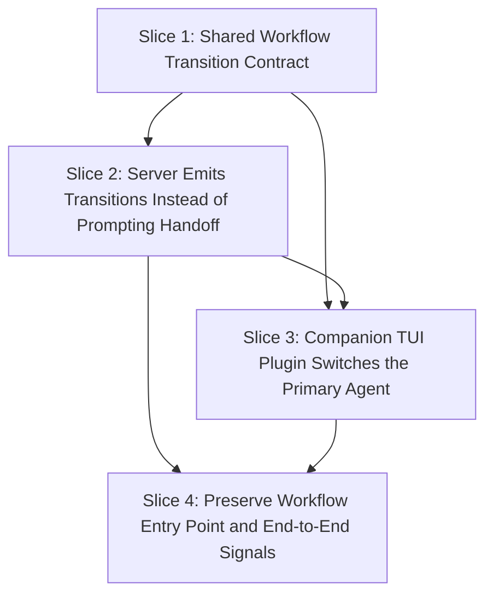

# Plan: TUI-Driven Workflow Control

**Created**: 2026-08-08T11:45:31Z
**Branch**: main
**Status**: in-progress
**Gherkin persistence**: plan-file-only

## Goal

Move approved workflow step transitions from server-side session prompting to TUI-driven primary-agent switching. `workflow_advance` will publish a shared workflow-transition event instead of calling `client.session.promptAsync` for handoff, and a companion TUI plugin will acknowledge the event after switching the TUI primary agent to the next workflow agent. The user remains in control: transitions still require explicit approval, `/specs` remains the entry point, and unhandled transitions produce a visible error rather than silently falling back to server prompting.

## Approach Stance

- **Destructive shape — replace vs. merge:** Replace the `workflow_advance` handoff mechanism by removing its `client.session.promptAsync` handoff block; merge/preserve unrelated plugin hooks and non-workflow client usage.
- **Evolution — migrate vs. edit stub:** Migrate handoff responsibility to a shared workflow-event contract plus a TUI companion module; do not edit a deprecated stub in place.
- **Scope — touch only requested:** Limit scope to transition signaling, acknowledgement/error handling, TUI primary-agent switching, exports/types/tests/docs needed for that behavior. Do not add command palette controls, keybindings, approval UX changes, persistent step dashboards, or model-selection changes.
- **Integration — auto-merge vs. direct-to-trunk:** Default to PR/green-check workflow; no direct-to-trunk landing is planned.

## Acceptance Criteria

- [ ] Approved non-final `workflow_advance` publishes a workflow-transition event with `nextStep`, `targetAgent`, and `reference`, waits for a transition acknowledgement/failure/timeout, and no longer calls `client.session.promptAsync` for handoff.
- [ ] The transition event name, acknowledgement/failure event names, payload shapes, and event coordinator/adapter interfaces are defined once in a shared module used by both server workflow code and TUI companion code.
- [ ] A companion TUI plugin subscribes to workflow-transition events and switches the TUI primary agent to `targetAgent` for both `specs → planner` and `planner → builder` transitions.
- [ ] `workflow_advance` with `approve: false` publishes no transition event, requests no agent switch, and reports that it is staying on the current step.
- [ ] `workflow_advance` on the final `builder` step publishes no transition event, requests no agent switch, and reports `Workflow complete. All steps (specs → planner → builder) approved.`
- [ ] If no active TUI companion acknowledges a transition within the configured timeout, `workflow_advance` returns an error result containing `[ERROR]`, `no TUI companion acknowledged`, and a recovery instruction to load the companion TUI plugin and restart opencode; it does not fall back to `client.session.promptAsync`.
- [ ] If the active TUI companion cannot switch the primary agent, it shows a color-independent error notification beginning `[ERROR] Workflow transition to <agent> failed` with a recovery instruction, emits a transition-failure acknowledgement, and does not report success.
- [ ] On a successful switch, the TUI companion shows a color-independent confirmation beginning `[OK] Workflow step: <nextStep> | Agent: <targetAgent>` without stealing focus from the active input field.
- [ ] `/specs` still starts the workflow through `workflow_start` from the user's perspective; its existing `promptAsync` startup behavior is preserved.

## Slices

A slice is a vertically deliverable increment. Each slice carries the Gherkin scenario(s) that define its behavior, followed by the TDD steps that satisfy them. Steps are numbered `<sliceId>.<step>` (1.1, 1.2, 2.1, …).

### Slice 1: Shared Workflow Transition Contract

**Depends-on:** none
**Files:** `src/workflow-events.ts`, `src/workflow-events.test.ts`

**Behavior:**

```gherkin
Feature: Shared workflow transition contract

  Scenario: Subscriber receives a specs-to-planner transition
    Given the workflow is on step "specs"
    When a workflow transition is published for reference "<approved-spec-reference>"
    Then subscribers receive a "workflow.transition.requested" event
    And the event names next step "planner"
    And the event targets agent "planner"
    And the event includes reference "<approved-spec-reference>"

  Scenario: Subscriber receives a planner-to-builder transition
    Given the workflow is on step "planner"
    When a workflow transition is published for reference "plans/tui-driven-workflow-control.md"
    Then subscribers receive a "workflow.transition.requested" event
    And the event names next step "builder"
    And the event targets agent "builder"
    And the event includes reference "plans/tui-driven-workflow-control.md"

  Scenario: Builder completion publishes no transition
    Given the workflow is on step "builder"
    When the approved final step is evaluated for transition
    Then no "workflow.transition.requested" event is published

  Scenario: Consumers ignore unrelated events
    Given a subscriber receives an event named "session.updated"
    When the event is checked against the shared workflow event contract
    Then no workflow transition payload is exposed to workflow handlers
    And no primary-agent switch begins
```

**Steps:**

#### Step 1.1: Define transition, acknowledgement, and validation contract

**Complexity**: standard
**IMPLEMENT**: Add one shared module that exports transition requested/acknowledged/failed event names, payload types, creator functions for non-final transitions, validators/type guards for consumed events, and a minimal `WorkflowTransitionCoordinator` interface for publish-and-await-ack behavior returning a discriminated outcome such as `{ status: 'acknowledged' | 'failed' | 'timeout'; targetAgent: string; message?: string }`.
**TEST**: Add unit tests covering `specs → planner`, `planner → builder`, no transition for `builder`, valid acknowledgement/failure payloads, and rejection of unrelated or malformed events; full unit suite green.
**REFACTOR**: Keep event naming, step-to-agent mapping, timeout defaults, and validation in one cohesive module with no duplicated literals beyond test expectations.
**Files**: `src/workflow-events.ts`, `src/workflow-events.test.ts`
**Commit**: `Add shared workflow transition event contract`

### Slice 2: Server Emits Transitions Instead of Prompting Handoff

**Depends-on:** 1
**Files:** `src/workflow.ts`, `src/workflow-events.ts`, `src/workflow.test.ts`, `src/index.ts`, `src/test/assertions.ts`

**Behavior:**

```gherkin
Feature: Server workflow transition signaling

  Scenario: Approved non-final step emits an acknowledged transition event
    Given the current workflow step is "specs"
    And the user has approved the step
    And the TUI companion will acknowledge the transition
    When the workflow advances with reference "<approved-spec-reference>"
    Then the event collector captures a "workflow.transition.requested" event for next step "planner"
    And the event targets agent "planner"
    And the server does not call `client.session.promptAsync` with agent "planner"
    And the server reports that the step was approved and the TUI handoff was acknowledged

  Scenario: Transition with no active TUI companion reports a recoverable error
    Given the current workflow step is "specs"
    And the user has approved the step
    And no TUI companion acknowledges the transition before the timeout
    When the workflow advances with reference "<approved-spec-reference>"
    Then the server returns an error result containing "[ERROR]"
    And the result contains "no TUI companion acknowledged"
    And the result tells the user to load the companion TUI plugin and restart opencode
    And the server does not call `client.session.promptAsync` with agent "planner"

  Scenario: Event emission failure is surfaced, not swallowed
    Given the current workflow step is "planner"
    And the user has approved the step
    And publishing the workflow-transition event fails
    When the workflow advances with reference "plans/tui-driven-workflow-control.md"
    Then the server returns an error result containing "[ERROR]"
    And the result contains "workflow transition event could not be published"
    And the server does not call `client.session.promptAsync` with agent "builder"

  Scenario: Approved final step completes without transition
    Given the current workflow step is "builder"
    And the user has approved the step
    When the workflow advances
    Then no "workflow.transition.requested" event is published
    And the server reports "Workflow complete. All steps (specs → planner → builder) approved."

  Scenario: Rejected step stays on the current step
    Given the current workflow step is "planner"
    And the user has not approved the step
    When the workflow advance is requested
    Then no "workflow.transition.requested" event is published
    And the server reports that it is staying on the current step

  Scenario: Workflow start still prompts the specs agent
    Given the workflow is started at "specs"
    When `workflow_start` runs
    Then `client.session.promptAsync` is called with agent "specs"
    And the server reports that the "specs" step is starting
```

**Steps:**

#### Step 2.1: Emit and await workflow transitions from `workflow_advance`

**Complexity**: standard
**IMPLEMENT**: Refactor `workflowTools` to accept the shared `WorkflowTransitionCoordinator`, wire the concrete coordinator from `src/index.ts`, and use it to publish approved non-final transitions and await acknowledged/failed/timeout outcomes.
**TEST**: Add focused unit tests with fake client/logger/coordinator asserting successful acknowledged payloads for `specs → planner` and `planner → builder`; error/timeout/failure branches are deferred to Step 2.3 and Slice 2 is not complete until those tests are green; full unit suite green.
**REFACTOR**: Keep `workflow_advance` branch logic readable by extracting transition outcome formatting rather than embedding payload or timeout literals inline.
**Files**: `src/workflow.ts`, `src/workflow-events.ts`, `src/workflow.test.ts`, `src/index.ts`
**Commit**: `Emit acknowledged workflow transition events`

#### Step 2.2: Remove server prompt handoff fallback

**Complexity**: standard
**IMPLEMENT**: Remove the `client.session.promptAsync` handoff block from `workflow_advance`; remove `HANDOFF` because it only served the old advance handoff; retain `MODEL` because `workflow_start` still uses it.
**TEST**: Extend workflow tests with a fake client spy proving `workflow_advance` does not call `session.promptAsync` for `planner` or `builder`, while `workflow_start` still calls it for `specs`; full unit suite green.
**REFACTOR**: Tighten return messages around “transition acknowledged,” “transition failed,” and “no TUI companion acknowledged” rather than “prompted.”
**Files**: `src/workflow.ts`, `src/workflow.test.ts`
**Commit**: `Remove promptAsync workflow handoff fallback`

#### Step 2.3: Cover server failure and no-transition branches

**Complexity**: standard
**IMPLEMENT**: Ensure rejected advances, final-step advances, transition publish failures, transition-failure acknowledgements, and acknowledgement timeouts produce explicit results and never fall back to session prompting.
**TEST**: Add tests for `approve: false`, `builder` final-step behavior, coordinator publish failure, TUI failure acknowledgement, and acknowledgement timeout; full unit suite green.
**REFACTOR**: Consolidate fake coordinator/client setup helpers in the workflow test file without hiding observable assertions.
**Files**: `src/workflow.ts`, `src/workflow.test.ts`, `src/workflow-events.ts`
**Commit**: `Cover workflow transition failure branches`

### Slice 3: Companion TUI Plugin Switches the Primary Agent

**Depends-on:** 1, 2
**Files:** `src/tui.ts`, `src/workflow-events.ts`, `src/tui.test.ts`, `src/index.ts`, `package.json`, `README.md`

**Behavior:**

```gherkin
Feature: TUI-driven primary-agent switching

  Scenario: TUI switches primary agent to planner
    Given the companion TUI plugin is active
    And the active input field has focus
    When a "workflow.transition.requested" event targets agent "planner" for next step "planner"
    Then the TUI primary agent is switched to "planner"
    And the companion emits a "workflow.transition.acknowledged" event for agent "planner"
    And the user sees "[OK] Workflow step: planner | Agent: planner"
    And the active input field keeps focus

  Scenario: TUI switches primary agent to builder
    Given the companion TUI plugin is active
    When a "workflow.transition.requested" event targets agent "builder" for next step "builder"
    Then the TUI primary agent is switched to "builder"
    And the companion emits a "workflow.transition.acknowledged" event for agent "builder"
    And the user sees "[OK] Workflow step: builder | Agent: builder"

  Scenario: TUI handles duplicate transition events idempotently
    Given the companion TUI plugin is active
    And the TUI primary agent is already "planner"
    When another "workflow.transition.requested" event targets agent "planner"
    Then no additional primary-agent switch is requested
    And no error notification is shown
    And the transition is acknowledged as already handled

  Scenario: TUI ignores unrelated events
    Given the companion TUI plugin is active
    When an event named "session.updated" is received
    Then no primary-agent switch is requested
    And no workflow acknowledgement event is emitted

  Scenario: TUI reports missing switch API clearly
    Given the companion TUI plugin is active
    And the primary-agent switch API is unavailable
    When a "workflow.transition.requested" event targets agent "planner"
    Then the user sees an error notification beginning "[ERROR] Workflow transition to planner failed"
    And the notification tells the user to check that the TUI companion plugin is loaded and restart opencode
    And the companion emits a "workflow.transition.failed" event for agent "planner"
    And the companion does not emit a successful acknowledgement

  Scenario: TUI reports switch exceptions clearly
    Given the companion TUI plugin is active
    And switching the primary agent throws an error
    When a "workflow.transition.requested" event targets agent "builder"
    Then the user sees an error notification beginning "[ERROR] Workflow transition to builder failed"
    And the companion emits a "workflow.transition.failed" event for agent "builder"
    And the companion does not emit a successful acknowledgement
```

**Steps:**

#### Step 3.1: Pin the TUI primary-agent adapter contract

**Complexity**: complex
**IMPLEMENT**: Inspect the installed/public opencode TUI plugin/API surface, define a one-method `TUIPrimaryAgentSwitcher` adapter contract, and bind the concrete TUI API behind that contract; if no switch API exists, fail this step with a documented blocker rather than inventing an undocumented mechanism.
**TEST**: Add at least one runtime adapter contract test with a manually crafted stub, plus static/type assertions if useful, proving the adapter can call the selected TUI API shape and reports unavailable capability deterministically; full unit suite green.
**REFACTOR**: Keep all uncertain opencode TUI API details inside the adapter boundary so event-handling logic remains framework-independent.
**Files**: `src/tui.ts`, `src/tui.test.ts`, `package.json`
**Commit**: `Pin TUI primary agent switch adapter`

#### Step 3.2: Subscribe to transitions and switch primary agents

**Complexity**: standard
**IMPLEMENT**: Add the TUI companion module/export that subscribes to the opencode event bus, filters events through the shared validator, switches to `targetAgent`, preserves input focus, emits transition acknowledgements, and shows `[OK] Workflow step: <nextStep> | Agent: <targetAgent>` on success.
**TEST**: Add unit tests with fake event subscription and fake TUI adapter proving both `planner` and `builder` targets switch, success acknowledgements are emitted, success notifications are text-visible, duplicate same-agent transitions are idempotent, and unrelated events are ignored; full unit suite green.
**REFACTOR**: Isolate event subscription, switch execution, acknowledgement emission, and notification formatting into small helpers with stable observable text.
**Files**: `src/tui.ts`, `src/workflow-events.ts`, `src/tui.test.ts`, `src/index.ts`
**Commit**: `Switch TUI primary agent on workflow transitions`

#### Step 3.3: Surface TUI transition failures

**Complexity**: standard
**IMPLEMENT**: When the TUI adapter is unavailable or throws, show `[ERROR] Workflow transition to <agent> failed: <reason>. Check that the TUI companion plugin is loaded and restart opencode, then run workflow_status to confirm the current step.`, emit a transition-failure event, and never emit a successful acknowledgement for that transition.
**TEST**: Add tests for missing switch capability and thrown switch errors asserting exact error prefix/recovery text, failure acknowledgement payload, absence of success acknowledgement, and no silent fallback to `client.session.promptAsync`; full unit suite green.
**REFACTOR**: Normalize success and failure notification text in one helper so tests, accessibility text, and user-facing messages stay stable.
**Files**: `src/tui.ts`, `src/tui.test.ts`, `src/workflow-events.ts`
**Commit**: `Report TUI workflow transition failures clearly`

#### Step 3.4: Package and document the companion plugin

**Complexity**: standard
**IMPLEMENT**: Add a dedicated package export for the TUI companion, e.g. `"./tui": { "types": "./dist/tui.d.ts", "default": "./dist/tui.js" }`, while preserving the existing `"."` server plugin export; document loading both server and TUI companion plugins plus the need to restart opencode after plugin/config changes.
**TEST**: Add or update package-level tests/static assertions verifying the expected `./tui` export resolves and the existing server plugin export remains intact; run unit tests and type check.
**REFACTOR**: Keep README usage focused on installing/loading the companion and new success/error messages rather than adding out-of-scope command palette or keybinding docs.
**Files**: `src/index.ts`, `src/tui.ts`, `package.json`, `README.md`, `src/tui.test.ts`
**Commit**: `Expose and document TUI companion plugin`

### Slice 4: Preserve Workflow Entry Point and End-to-End Signals

**Depends-on:** 2, 3
**Files:** `src/test/dev-team.e2e.ts`, `src/test/harness.ts`, `src/test/assertions.ts`, `src/workflow.ts`, `src/index.ts`, `README.md`

**Behavior:**

```gherkin
Feature: Workflow remains user-driven end to end

  Scenario: Starting specs still uses the specs agent
    Given the user starts the workflow with "/specs"
    When the workflow start command runs
    Then `workflow_start` prompts the session with agent "specs"
    And the user sees that the "specs" step is starting

  Scenario: Approved specs handoff is visible as an event and not a prompt
    Given the specs step has produced an approved artifact
    And the event collector is subscribed
    When the workflow advances from "specs" with reference "<approved-spec-reference>"
    Then the event collector captures a "workflow.transition.requested" event targeting agent "planner"
    And the prompt spy records no `client.session.promptAsync` call with agent "planner"

  Scenario: Missing TUI acknowledgement is visible in the tool result
    Given the specs step has produced an approved artifact
    And no TUI acknowledgement is received before the timeout
    When the workflow advances from "specs"
    Then the tool result contains "[ERROR]"
    And the tool result contains "no TUI companion acknowledged"
    And the prompt spy records no `client.session.promptAsync` call with agent "planner"

  Scenario: Completed builder step ends the workflow
    Given the builder step is approved
    When the workflow advances from "builder"
    Then the workflow reports "Workflow complete. All steps (specs → planner → builder) approved."
    And the event collector captures no "workflow.transition.requested" event
```

**Steps:**

#### Step 4.1: Extend integration coverage for start and transition signals

**Complexity**: standard
**IMPLEMENT**: Update the existing headless harness/e2e tests or add focused integration tests to prove `/specs` startup still reaches the specs agent, approved handoff is observable as an event, missing acknowledgement is visible in the tool result, and no server prompt to the next agent occurs.
**TEST**: Integration assertions use concrete observation channels: event collector captures transition events, fake/patched prompt spy records absence of next-agent `promptAsync` when the harness can inject that spy, and tool results contain the expected `[ERROR]`/completion text. If prompt spying is not practical in the headless harness, keep the absence assertion in Step 2.2 unit tests and make the integration test focus on event observation and tool result text; run integration path plus unit tests.
**REFACTOR**: Reuse existing event collector/assertion helpers and avoid duplicating message-part parsing; keep WireMock prerequisite notes in README/test comments only where they already support the e2e harness.
**Files**: `src/test/dev-team.e2e.ts`, `src/test/harness.ts`, `src/test/assertions.ts`, `src/workflow.ts`
**Commit**: `Verify workflow transition signals in harness`

#### Step 4.2: Documentation alignment

**Complexity**: trivial
**IMPLEMENT**: Align README wording and stale inline comments with the new TUI-driven handoff, success/error messages, package exports, and restart requirement; preserve out-of-scope boundaries.
**TEST**: Run type check and affected unit tests if comments/docs touched adjacent typed exports; final full-suite execution remains in the Pre-PR Quality Gate.
**REFACTOR**: Remove stale comments such as the old promptAsync deadlock explanation and simplify names around “transition” vs “handoff.”
**Files**: `src/workflow.ts`, `src/index.ts`, `src/tui.ts`, `README.md`
**Commit**: `Document TUI-driven workflow handoff`

## Parallelization DAG



- **Wave 1:** Slice 1
- **Wave 2:** Slice 2
- **Wave 3:** Slice 3
- **Wave 4:** Slice 4

## Complexity Classification

Each step includes a complexity rating that controls review depth during `/builder`:

| Rating | Criteria | Review depth |
|--------|----------|--------------|
| `trivial` | Single-file rename, config change, typo fix, documentation-only | Skip inline review; covered by final `/code-review` |
| `standard` | New function, test, module, or behavioral change within existing patterns | Spec-compliance + relevant quality agents |
| `complex` | Architectural change, security-sensitive, cross-cutting concern, new abstraction | Full agent suite including opus-tier agents |

This plan is **complex** because it introduces a new companion TUI integration, a shared event/acknowledgement contract, an adapter around an uncertain TUI API boundary, and more than one sequential wave. Step 3.1 is explicitly complex due to the primary-agent switch API boundary and export-shape validation.

## Pre-PR Quality Gate

- [ ] All tests pass (`mise run test` and focused `bun test`/Vitest commands used during build)
- [ ] Type check passes (`bunx tsc --noEmit`)
- [ ] Linter passes if configured in the project by the time of build
- [ ] `/code-review` passes
- [ ] Documentation updated for TUI-driven handoff, companion loading, success/error messages, and restart requirement
- [ ] Build/package dry-run verifies `dist/index.js`, `dist/index.d.ts`, `dist/tui.js`, and `dist/tui.d.ts` are produced when package exports reference them

## Skipped (low value)

No `LOW_VALUE` findings were identified in the approved spec or planning pass.

## Risks & Open Questions

- **TUI API shape risk:** Public docs list server plugin hooks and TUI SDK actions but do not clearly document a typed companion TUI plugin export or primary-agent switch API. Mitigation: Slice 3.1 must inspect the installed/public API and pin the adapter contract before transition handling is built; if no switch API exists, it fails with a documented blocker rather than inventing an undocumented mechanism.
- **Acknowledgement timeout semantics:** The plan commits to explicit acknowledgement/failure events and a timeout so a missing TUI companion is visible to the user. Timeout length should be short and deterministic in tests, with production default defined in `src/workflow-events.ts`.
- **Headless test limitations:** Existing e2e harness is server/headless and may not exercise a real TUI. Mitigation: cover TUI companion behavior with adapter-level unit tests and keep harness tests focused on event publication, acknowledgement outcomes, tool results, and absence of prompt handoff.
- **Session restart recovery:** Automatic restoration of the current workflow step after restarting opencode is out of scope for this MVP. Recovery guidance is included in error text via `workflow_status`; richer restoration can be planned separately.
- **Spec artifact present:** Planning used `docs/specs/tui-driven-workflow-control.md` as the approved spec source.
- **Gherkin persistence prompt skipped:** stdin is not a usable TTY in this run, so Gherkin persistence is recorded as `plan-file-only` per planner rules.

## Plan Review Summary

Plan tier: complex — reviewers: Acceptance Test Critic, Design & Architecture Critic, UX Critic, Strategic Critic, Gherkin Quality Critic.

- **Acceptance Test Critic:** approve after revision. Prior blockers around vague AC6 error behavior, implementation-coupled Gherkin, missing planner→builder coverage, missing `workflow_start` scenario, and event-emission failure coverage were resolved. Remaining warnings are minor wording/test-seam clarifications incorporated into the plan.
- **Design & Architecture Critic:** approve after revision. Prior blockers around the undefined event/coordinator interface and unresolved no-TUI-context detection were resolved by the shared coordinator contract plus acknowledgement/failure/timeout architecture. Remaining warnings about coordinator outcome shape, `workflowTools` wiring, e2e prompt-spy practicality, and package dry-run are incorporated as implementation/test guidance.
- **UX Critic:** approve after revision. Prior blockers around unactionable failure UX and silent no-companion behavior were resolved with exact `[ERROR]` recovery text, `[OK]` success confirmation, color-independent prefixes, focus preservation, completion text, and timeout-based visibility. Remaining warning: session restart recovery is intentionally scoped out; README/error text should guide users to `workflow_status`.
- **Strategic Critic:** approve. The plan addresses the root cause, keeps scope focused, and sequences the work proportionally. Warnings about API discovery and acknowledgement feasibility were resolved by adding Slice 3.1 and explicit acknowledgement semantics.
- **Gherkin Quality Critic:** approve after revision. Prior blockers around absent TUI context, planner→builder TUI switch, Slice 4 negative/regression coverage, and vague observability were resolved. Remaining warning: Slice 4 integration coverage exercises `specs → planner`; `planner → builder` is covered at unit/adapter levels.

## Approval

Auto-approved (non-interactive) at 2026-08-08T11:51:41Z — no human review gate. Trigger: no TTY.

Audit note: appending the required approval entry to `metrics/config-changelog.jsonl` was attempted but blocked by the current edit permission policy, which only allows edits under `plans/**`. The approval evidence and surfaced risks are recorded in this plan instead.

Builder acceptance-criteria gate auto-passed (non-interactive) at build start — no human gate. Trigger: no TTY. The pre-build criteria verifier flagged 9 findings: unspecified timeout default in AC1; AC6 recovery instruction not exact enough; AC7 color-independence observation channel underspecified; AC8 focus preservation lacks automated seam; Slice 1 builder-completion scenario has an incomplete approved-step precondition; Slice 1 unrelated-event scenario leaks into TUI layer; Slice 2 `promptAsync` negative assertion should mean no handoff prompt call with any argument; Step 2.1 test wording forward-depends on Step 2.3; Step 3.4 export-resolution checks should be split into JSON/type/build checks. Per non-interactive builder rules this gate is bypassed and findings remain auditable here.

## Build Progress

This section is the machine-parseable recovery handle. `/builder` updates checkboxes here via Edit tool so progress survives a `/new` or session restart. `/continue` reads this section to determine the resume point.

### Slices

- [x] Slice 1: Shared Workflow Transition Contract
  - [x] Step 1.1: Define transition, acknowledgement, and validation contract
- [x] Slice 2: Server Emits Transitions Instead of Prompting Handoff
  - [x] Step 2.1: Emit and await workflow transitions from `workflow_advance`
  - [x] Step 2.2: Remove server prompt handoff fallback
  - [x] Step 2.3: Cover server failure and no-transition branches
- [ ] Slice 3: Companion TUI Plugin Switches the Primary Agent
  - [ ] Step 3.1: Pin the TUI primary-agent adapter contract
  - [ ] Step 3.2: Subscribe to transitions and switch primary agents
  - [ ] Step 3.3: Surface TUI transition failures
  - [ ] Step 3.4: Package and document the companion plugin
- [ ] Slice 4: Preserve Workflow Entry Point and End-to-End Signals
  - [ ] Step 4.1: Extend integration coverage for start and transition signals
  - [ ] Step 4.2: Documentation alignment
